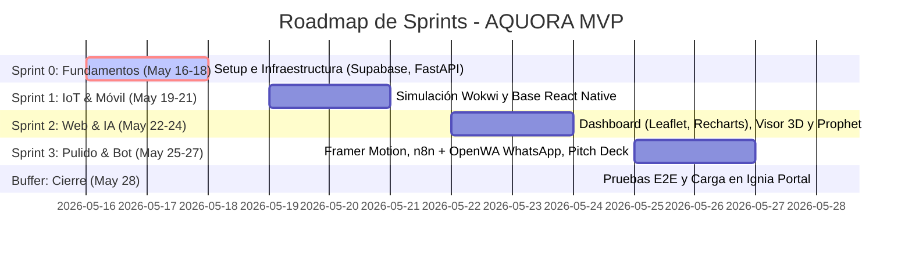
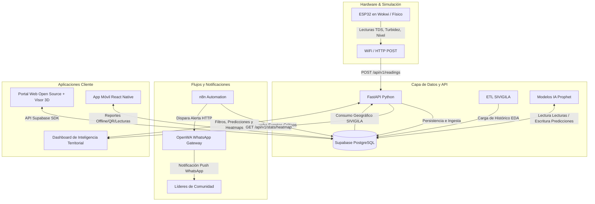

# AQUORA: Ecosistema Abierto e Inteligencia Territorial
## Índice de Desarrollo y Arquitectura MVP Unificada

Este documento actúa como el **Orquestador Principal** del ecosistema de desarrollo para el MVP de AQUORA en la hackathon. Consolida los hallazgos de la *Documentación Maestra* y el documento de *Arquitectura MVP Unificada V3*, estructurando el plan de trabajo en **6 fases de desarrollo altamente técnicas y agénticas**.

Cada fase ha sido desglosada en su propio archivo de especificación detallada dentro de la carpeta `Fases de Desarrollo/` para permitir una ejecución secuencial, ágil e independiente (ya sea por desarrolladores humanos o agentes de IA).

---

## 1. Mapa de Ruta del Ecosistema (Sprints)

El desarrollo del MVP de AQUORA se distribuye a lo largo de un ciclo comprimido de Scrum de la siguiente manera:



---

## 2. Índice de Fases de Desarrollo

Haga clic en cada fase para abrir su especificación técnica completa:

1. **[Fase 1: Fundamentos, Base de Datos y Backend (Sprint 0)](file:///E:/AQUORA/Fases%20de%20Desarrollo/01_Fase_Fundamentos_y_Backend.md)**
   * *Alcance:* Creación del monorepo, inicialización de Supabase con DDL SQL completo (comunidades, dispositivos, lecturas), RLS y endpoints API iniciales con FastAPI para telemetría e integración de mapas de calor.
2. **[Fase 2: Hardware Simulado y Telemetría IoT (Sprint 1)](file:///E:/AQUORA/Fases%20de%20Desarrollo/02_Fase_Hardware_y_Telemetria.md)**
   * *Alcance:* Simulación del gemelo digital en Wokwi (ESP32 con potenciómetros para TDS, Turbidez y Nivel de agua) y programación del firmware C++ con reintentos de WiFi, promedios móviles para calibración y envío HTTP POST.
3. **[Fase 3: Ecosistema Web: Portal Open Source & Dashboard de Control (Sprint 2)](file:///E:/AQUORA/Fases%20de%20Desarrollo/03_Fase_Ecosistema_Web_y_Visor_3D.md)**
   * *Alcance:* Landing Page en React/Vite con Framer Motion, visor 3D interactivo en la web para el ensamblaje del filtro. Dashboard de la Fundación Ábaco con Leaflet.js para mapas de estrés hídrico y Recharts para series temporales de calidad de agua.
   * **[Subfases de la Fase 3 (Seguridad, Landing Page y Autenticación GitHub OAuth + RBAC)](file:///E:/AQUORA/Fases%20de%20Desarrollo/03_Subfases_Fase_Tres)**:
     * **[Subfase 3.1: Portal Público y Doc Open Source](file:///E:/AQUORA/Fases%20de%20Desarrollo/03_Subfases_Fase_Tres/03_Subfase_3.1_Portal_Publico_y_Landing.md)**: Landing page interactiva y documentación del firmware del ESP32 con simulación Wokwi.
     * **[Subfase 3.2: Autenticación con Supabase Auth (Email/Password) y Roles](file:///E:/AQUORA/Fases%20de%20Desarrollo/03_Subfases_Fase_Tres/03_Subfase_3.2_Autentificacion_GitHub_OAuth.md)**: Sistema de inicio de sesión directo por correo, base de datos de perfiles RBAC en Supabase, y automatización segura de credenciales locales.
     * **[Subfase 3.3: Área Administrativa, Cuentas Comunitarias y Cambio de Contraseñas](file:///E:/AQUORA/Fases%20de%20Desarrollo/03_Subfases_Fase_Tres/03_Subfase_3.3_Area_Administrativa_y_Monitoreo.md)**: Formulario administrativo para crear cuentas de miembros con contraseña temporal y asignación de filtros, dashboard privado para la comunidad e interfaz de cambio de contraseñas de usuario.
     * **[Subfase 3.4: Integración de Git, Ciberseguridad de Secretos y Despliegues Automáticos](file:///E:/AQUORA/Fases%20de%20Desarrollo/03_Subfases_Fase_Tres/03_Subfase_3.4_Integracion_Git_y_Seguridad_Secretos.md)**: Estándares de seguridad de secretos, commits segregados detallados en español para cada módulo y flujo CD con GitHub Pages.
4. **[Fase 4: Aplicación Móvil React Native (Sprint 1 / Sprint 2-3)](file:///E:/AQUORA/Fases%20de%20Desarrollo/04_Fase_Aplicacion_Movil_React_Native.md)**
   * *Alcance:* Inicialización con Expo, módulo de "Reporte Rápido" (OK, TURBIO, SECO, ROTO) geolocalizado mediante GPS, diagnóstico y mantenimiento mediante escaneo QR (Cámara), y base de datos offline para resiliencia en zonas sin cobertura.
5. **[Fase 5: Inteligencia Predictiva, Workflows y WhatsApp Bot (Sprint 2-3)](file:///E:/AQUORA/Fases%20de%20Desarrollo/05_Fase_Inteligencia_y_Automatizacion.md)**
   * *Alcance:* Script en Python para entrenamiento predictivo a 7 días de riesgo EDA usando Facebook Prophet y datos de SIVIGILA/Sensores; workflows reactivos en n8n para umbrales críticos de calidad; y despliegue autoalojado de OpenWA Docker para alertas preventivas comunitarias vía WhatsApp.
6. **[Fase 6: Integración Final, Pruebas End-to-End y Pitch Deck (Sprint 3 / Buffer)](file:///E:/AQUORA/Fases%20de%20Desarrollo/06_Fase_Integracion_Pruebas_y_Pitch.md)**
   * *Alcance:* Protocolo de pruebas de integración completa (Wokwi -> FastAPI -> Supabase -> n8n -> OpenWA -> Web/Móvil), script de simulación automática, estructura del Pitch Deck de 10 diapositivas y directrices de grabación de demo para jurados de hackathon.

---

## 3. Arquitectura Tecnológica Unificada

El ecosistema de datos de AQUORA fluye de la siguiente forma a través de sus componentes:



---

## 4. Estructura Recomendada del Repositorio (Monorepo)

Para garantizar la agilidad durante la hackathon y permitir que múltiples desarrolladores/agentes trabajen en paralelo, se recomienda utilizar un monorepo con la siguiente estructura:

```text
aquora-monorepo/
├── backend/                  # API en FastAPI (Python 3.10+)
│   ├── app/
│   │   ├── api/              # Endpoints (readings, predictions, stats)
│   │   ├── core/             # Configuración y variables de entorno
│   │   ├── models/           # Esquemas Pydantic
│   │   └── services/         # Conexión con Supabase y lógica del Prophet
│   ├── requirements.txt      # Dependencias del backend
│   └── main.py               # Punto de entrada de FastAPI
├── hardware/                 # Firmware C++ y esquemáticos
│   ├── esp32-telemetry/
│   │   ├── esp32-telemetry.ino  # Firmware principal para Arduino IDE / Wokwi
│   │   └── diagram.json      # Configuración de conexiones de Wokwi
├── web/                      # Portal Web y Dashboard (React 18)
│   ├── src/
│   │   ├── components/       # Componentes reusables (3D Visor, Charts, Leaflet)
│   │   ├── pages/            # Landing y Dashboard de la Fundación Ábaco
│   │   └── services/         # Cliente API y Supabase SDK
│   ├── package.json
│   └── tailwind.config.js
├── mobile/                   # App Móvil (React Native con Expo)
│   ├── src/
│   │   ├── components/       # Botón de reporte rápido, Escáner QR
│   │   ├── screens/          # Reportes, Diagnóstico Técnico, Historial
│   │   └── services/         # Almacenamiento local (SQLite/AsyncStorage)
│   └── package.json
└── automation/               # Configuración de n8n y Docker
    ├── docker-compose.yml    # Despliegue de n8n y OpenWA
    └── n8n-workflow.json     # Plantilla del flujo de alertas automatizado
```

> [!NOTE]
> Cada una de las 6 fases contiene el código base funcional y las instrucciones paso a paso para inicializar e integrar todos los elementos mostrados en este índice. Proceda a abrir el primer documento: **[Fase 1: Fundamentos y Backend](file:///E:/AQUORA/Fases%20de%20Desarrollo/01_Fase_Fundamentos_y_Backend.md)**.
