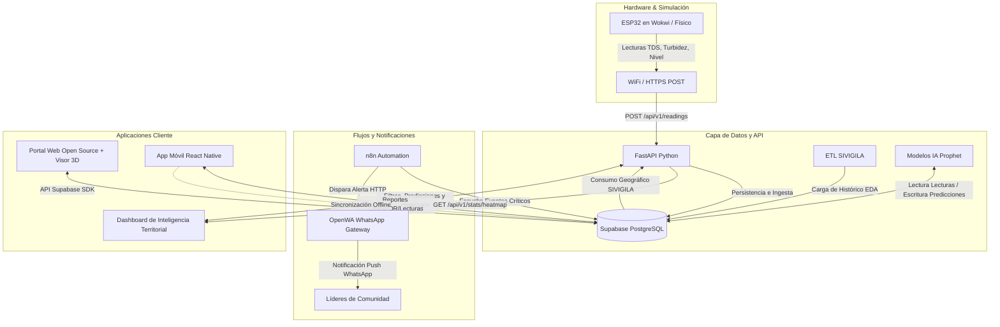
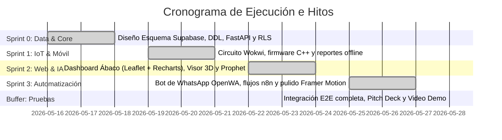

# 💧 AQUORA: Agua Segura, Nutrición Posible

<p align="center">
  
  
  
  
  
  
</p>

---

## 🌀 ¿Qué es AQUORA?

**AQUORA** es un ecosistema tecnológico integral de código abierto que conecta la **seguridad del agua**, el **monitoreo inteligente en tiempo real** y el **análisis predictivo territorial** para potenciar el impacto de las intervenciones nutricionales en comunidades vulnerables de Colombia (como La Guajira y Chocó). 

### 🚨 El Problema
La desnutrición crónica infantil en zonas rurales no se resuelve únicamente entregando alimentos o suplementos. En la gran mayoría de los casos, la presencia persistente de **Enfermedades Diarreicas Agudas (EDA)**, provocadas por la ingesta de agua con alta turbidez, bacterias y sólidos disueltos (TDS), genera un estado inflamatorio en el intestino que impide la absorción correcta de los nutrientes. Sin agua potable, la inversión nutricional se pierde.

### 💡 La Solución
AQUORA elimina la "ceguera" institucional respecto a la calidad del agua consumida y el estado real de los filtros comunitarios mediante:
1. **Purificación física modular:** Filtros abiertos con capas de arena silícea, zeolita y bagazo de caña (economía circular).
2. **Telemetría IoT de bajo costo:** Un sensor inteligente basado en **ESP32** que mide sólidos disueltos (TDS), turbidez y nivel de almacenamiento del agua, simulado de forma interactiva en **Wokwi** y desplegable en hardware físico.
3. **API & Data Core (FastAPI + Supabase):** Ingesta masiva y segura de lecturas con validación criptográfica de tokens y roles.
4. **Inteligencia Territorial Predictiva (Facebook Prophet):** Modelado predictivo a 7 días que cruza la telemetría hídrica con los registros históricos del SIVIGILA para predecir brotes de EDA.
5. **Dashboard e Interfaz Web Inmersiva (React/Vite + Leaflet.js + Recharts + Visor 3D):** Portal público interactivo para visualización del ensamble en 3D/XR, y panel privado para la Fundación Ábaco con mapas de estrés hídrico y semáforos de alerta.
6. **Ecosistema Comunitario Móvil (React Native):** Aplicación móvil fuera de línea (offline-first) con GPS para reportes manuales de la comunidad y cámara integrada para diagnósticos técnicos por códigos QR.
7. **Alertas Automatizadas (n8n + OpenWA):** Notificaciones preventivas directas y automáticas a los teléfonos móviles de los líderes comunitarios mediante un bot de WhatsApp autoalojado en Docker.

---

## 🗺️ Índice del Proyecto

1. [Arquitectura Tecnológica Unificada](#-arquitectura-tecnológica-unificada)
2. [Estructura del Repositorio (Monorepo)](#-estructura-del-repositorio-monorepo)
3. [Módulos del Sistema](#-módulos-del-sistema)
   * [1. Backend & API (`backend/`)](#1-backend--api-backend)
   * [2. Portal Web & Dashboard (`web/`)](#2-portal-web--dashboard-web)
   * [3. App Móvil Comuntaria (`mobile/`)](#3-app-móvil-comuntaria-mobile)
   * [4. Telemetría y Hardware (`hardware/`)](#4-telemetría-y-hardware-hardware)
   * [5. Inteligencia Artificial & Automatización](#5-inteligencia-artificial--automatización)
4. [Guía de Simulación y Sandbox Rápido](#-guía-de-simulación-y-sandbox-rápido)
5. [Seguridad, Criptografía y RLS](#-seguridad-criptografía-y-rls)
6. [Roadmap del Proyecto](#-roadmap-del-proyecto)
7. [Licencia y Créditos](#-licencia-y-créditos)

---

## 🏗️ Arquitectura Tecnológica Unificada

El ecosistema de AQUORA integra flujos bidireccionales de telemetría, predicción probabilística y notificaciones reactivas. A continuación se detalla cómo interactúan los componentes en tiempo real:



---

## 📂 Estructura del Repositorio (Monorepo)

Este repositorio está estructurado como un monorepo modular organizado de la siguiente manera:

```text
AQUORA/
├── backend/                         # Capa de API REST y orquestación de datos (Python)
│   ├── app/
│   │   └── core/                    # Claves de cifrado, esquemas y configuraciones
│   ├── seed_community_accounts.py   # Semillero de perfiles de usuario con roles RBAC
│   ├── seed_full_pilot_dataset.py   # Simulador de datos históricos de EDA y telemetría
│   ├── seed_more_filters.py         # Registro de dispositivos adicionales en Supabase
│   ├── seed_readings.py             # Generador de lecturas de prueba
│   ├── fix_telemetry.py             # Script de corrección y limpieza de telemetría huérfana
│   ├── list_api_keys.py             # Utilidad para auditar claves de API del firmware
│   ├── query_schema.py              # Validador de esquemas relacionales
│   ├── setup_auth.sql               # Código SQL DDL para RLS y disparadores de perfiles
│   ├── main.py                      # Código fuente de FastAPI (1,200+ líneas documentadas)
│   ├── requirements.txt             # Dependencias del entorno virtual de Python
│   └── .env.example                 # Plantilla de variables de entorno para backend
├── hardware/                        # Firmware C++ y gemelo digital interactivo
│   └── esp32-telemetry/
│       ├── esp32-telemetry.ino      # Firmware C++ optimizado con filtro de promedio móvil
│       └── diagram.json             # Conexiones eléctricas virtuales de Wokwi
├── web/                             # Frontend SPA (React 18 + Vite)
│   ├── public/                      # Activos públicos y modelos 3D del purificador
│   ├── src/
│   │   ├── components/              # Visor interactivo 3D, mapas Leaflet y gráficos Recharts
│   │   ├── services/                # Conexiones con Supabase y fallback seguro
│   │   ├── App.jsx                  # Lógica del Portal Web y Dashboard (50,000+ caracteres)
│   │   ├── App.css                  # Hoja de estilos del portal
│   │   └── index.css                # Sistema de diseño HSL Dark minimalist
│   └── package.json                 # Dependencias Node.js del Frontend
├── mobile/                          # App nativa comunitaria (React Native + Expo)
│   ├── src/
│   │   ├── screens/                 # Pantallas de reporte rápido, diagnóstico y mapas
│   │   └── services/                # Conector a Supabase DB con lógica offline-first
│   ├── App.tsx                      # Componente raíz de la app móvil y navegación
│   └── package.json                 # Dependencias Node.js del móvil
├── tools/                           # Scripts de automatización y ayuda al desarrollo
│   └── simulate-esp32.ps1           # Script PowerShell para simular telemetría en vivo
├── Fases de Desarrollo/             # Guías paso a paso de arquitectura y codificación agéntica
│   ├── 00_Indice_de_Desarrollo.md   # Índice principal e hitos de los Sprints
│   ├── 01_Fase_Fundamentos_y_Backend.md
│   ├── 02_Fase_Hardware_y_Telemetria.md
│   ├── 03_Fase_Ecosistema_Web_y_Visor_3D.md
│   ├── 03.5_Fase_Ajuste_Visual_Firmware_y_Resiliencia.md
│   ├── 04_Fase_Aplicacion_Movil_React_Native.md
│   ├── 05_Fase_Inteligencia_y_Automatizacion.md
│   └── 06_Fase_Integracion_Pruebas_y_Pitch.md
├── AQUORA_Arquitectura_MVP_Unificada_V3.pdf # Reporte de ingeniería y diseño
├── AQUORA_Documentacion_Maestra.md  # Especificaciones funcionales originales
├── LICENSE                          # Licencia MIT y logo de arte ASCII
└── README.md                        # Este archivo
```

---

## 🛠️ Módulos del Sistema

### 1. Backend & API (`backend/`)
El corazón del flujo de información está desarrollado sobre **FastAPI (Python)** y una base de datos distribuida en **Supabase (PostgreSQL)**. 

#### 🔧 Tecnologías Clave:
* **FastAPI:** Framework asíncrono de alto rendimiento para construir APIs con documentación automática (Swagger UI).
* **Supabase Python SDK:** Acceso rápido y reactivo a la base de datos con autenticación federada.
* **Bcrypt & Criptografía:** Algoritmo seguro para hashing de API Keys y gestión de contraseñas de las cuentas comunitarias.
* **Pydantic v1:** Validación rigurosa del payload entrante para evitar inyecciones e inconsistencias de datos de los sensores.

#### 📡 API Endpoints Documentados:

| Método | Endpoint | Entrada (Payload) | Propósito | Autenticación |
| :--- | :--- | :--- | :--- | :--- |
| **POST** | `/api/v1/readings` | `device_key`, `tds_ppm`, `turbidity_ntu`, `water_level_pct` | Ingesta de telemetría en tiempo real desde el ESP32. | **Firmware API Key** |
| **GET** | `/api/v1/stats/heatmap` | *Ninguno* | Retorna la lista de comunidades geolocalizadas cruzada con el nivel de riesgo EDA. | Pública |
| **GET** | `/api/v1/readings/history/{community_id}` | *Parámetro URL* | Historial de telemetría para graficar tendencias en Recharts. | Pública |
| **POST** | `/api/v1/admin/users` | `email`, `password`, `full_name`, `role`, `community_id` | Creación de cuentas comunitarias de mantenimiento y líderes. | **Admin Role (JWT)** |
| **GET** | `/api/v1/admin/users` | *Ninguno* | Lista todos los usuarios de la plataforma y su rol. | **Admin Role (JWT)** |
| **DELETE** | `/api/v1/admin/users/{user_id}` | *Parámetro URL* | Elimina una cuenta de usuario. | **Admin Role (JWT)** |
| **POST** | `/api/v1/manual-reports` | `community_id`, `reporter_name`, `status`, `notes`, `latitude`, `longitude` | Envío de un reporte manual de calidad del agua. | Pública / Mobile |
| **GET** | `/api/v1/manual-reports` | *Ninguno* | Lista todos los reportes comunitarios recibidos. | Privada (Mantenimiento) |
| **GET** | `/api/v1/devices/{device_id}/status` | *Parámetro URL* | Consulta el estado operativo actual del purificador físico. | Pública |

#### 📂 Estructura de la Base de Datos (Supabase):
1. **`communities`:** Registra las comunidades rurales geolocalizadas, densidad poblacional y casos acumulados de desnutrición/EDA.
2. **`devices`:** Filtros instalados. Almacena la clave hash criptográfica (`api_key_hash`), fecha de instalación y el estado de la celda de purificación.
3. **`sensor_readings`:** Historial de telemetría con marcas de tiempo precisas para alimentar las series de análisis.
4. **`manual_reports`:** Reportes rápidos geolocalizados de la comunidad (Estado: `OK`, `Turbio`, `Seco`, `Roto`).
5. **`user_profiles`:** Base de control RBAC (`admin`, `tecnico`, `comunidad`) vinculada a Supabase Auth.
6. **`filter_requests` y `community_requests`:** Módulos de admisión y expansión territorial.

---

### 2. Portal Web & Dashboard (`web/`)
Una experiencia de usuario (UX/UI) futurista y de ultra-alto rendimiento visual diseñada bajo la estética **Minimalist Dark con acentos carmesí finos y gradientes HSL**.

```text
 🧭 PORTAL PÚBLICO (React)                 📊 DASHBOARD ÁBACO (Leaflet/Recharts)
 ┌─────────────────────────────┐           ┌─────────────────────────────┐
 │    ⚡ AQUORA Eco-Platform   │           │ 🗺️ Mapa de Estrés Hídrico   │
 │   [ Landing ] [ Visor 3D ]  │           │   ● Verde (OK)   ● Rojo (EDA) │
 │                             │           ├─────────────────────────────┤
 │   [ Documentación Abierta ] │           │ 📈 Curvas de TDS & Turbidez │
 └─────────────────────────────┘           └─────────────────────────────┘
```

#### 🔧 Tecnologías Clave:
* **Vite + React 18:** Compilación ultrarrápida y renderizado reactivo instantáneo.
* **Tailwind CSS:** Diseño responsivo y animaciones fluidas adaptadas a móviles y escritorios.
* **Framer Motion:** Micro-interacciones premium, transiciones de páginas dinámicas y efectos de aparición en scroll.
* **Leaflet.js:** Mapas cartográficos con clusters e interactividad personalizada que pintan gradientes geográficos del riesgo sanitario.
* **Recharts:** Gráficas vectoriales interactivas y responsivas que visualizan el comportamiento histórico de los sensores.
* **Visor 3D / XR:** Modelo interactivo tridimensional integrado en el portal web que describe detalladamente las capas internas del filtro (arena, zeolita, bagazo) simulando flujos inmersivos.

---

### 3. App Móvil Comuntaria (`mobile/`)
Una aplicación diseñada específicamente para **condiciones extremas de campo** (alta vulnerabilidad, baja cobertura de red).

#### 🔧 Tecnologías Clave:
* **React Native + Expo:** Despliegue nativo multiplataforma (Android & iOS).
* **Offline-first Sync:** Guardado en almacenamiento local persistente (`AsyncStorage` / caché interna) que sincroniza automáticamente con Supabase en cuanto el técnico/líder recupera la cobertura celular.
* **Diagnóstico por Código QR:** Uso integrado de la cámara móvil para escanear las etiquetas de los filtros y desplegar inmediatamente la interfaz de recambio y diagnóstico del dispositivo.
* **Módulo de Reporte Rápido (GPS):** Envío de 4 botones simplificados de estado con captura automática de coordenadas geográficas.

---

### 4. Telemetría y Hardware (`hardware/`)
El gemelo digital virtual y el firmware para el hardware físico encargado de medir la salubridad del agua y su nivel en el tanque de almacenamiento.

```text
                       🔌 ESQUEMA DE CONEXIONES EN WOKWI
     ┌──────────────────────────────────────────────────────────────┐
     │                     ESP32 DevKit-C v4                        │
     │  [3.3V]  [GND]   [GPIO34]  [GPIO35]   [GPIO5]    [GPIO18]    │
     └───┬────────┬─────────┬─────────┬─────────┬──────────┬────────┘
         │        │         │         │         │          │
        VCC      GND       SIG        │         │          │
     ┌───┴────────┴─────────┴┐        │         │          │
     │   Sensor TDS (Pot)    │        │         │          │
     └───────────────────────┘       SIG        │          │
                               ┌──────┴─────────┴┐         │
                               │Sensor Turbidez  │         │
                               └─────────────────┘        TRIG
                                                    ┌──────┴───────┐
                                                    │   Sensor     │
                                                    │ Ultrasonido  │
                                                    │  (HC-SR04)   │
                                                    └──────┬───────┘
                                                          ECHO
```

#### 🔌 Mapeo de Pines del ESP32:
* **Sensor TDS (Potenciómetro):** Pin `GPIO34` (ADC1)
* **Sensor Turbidez (Potenciómetro):** Pin `GPIO35` (ADC1)
* **Sensor de Nivel (Ultrasonido HC-SR04):**
  * `TRIG` → Pin `GPIO5`
  * `ECHO` → Pin `GPIO18`
* **LED Indicador de Diagnóstico:** Pin `GPIO2` (LED integrado)

#### 🛡️ Características Inteligentes del Firmware:
1. **Filtro de Promedio Móvil (Moving Average):** Mantiene un búfer circular de $N=20$ lecturas analógicas continuas. Esto suaviza el ruido eléctrico de los sensores antes de realizar la conversión a unidades físicas (ppm y NTU).
2. **Resiliencia de Red Integrada:** Si la conexión WiFi se cae, el bucle de control no se bloquea; entra en un modo de reconexión asíncrono para evitar la pérdida de telemetría local.
3. **Bypass de Advertencias:** Inyecta de forma nativa la cabecera `ngrok-skip-browser-warning` para permitir túneles de desarrollo locales sin bloqueos de proxy.
4. **Criptografía Embebida:** Adjunta la cabecera de autenticación segura utilizando la API Key provista por el aprovisionamiento web.

---

### 5. Inteligencia Artificial & Automatización

* **Modelo Predictivo de Riesgo (Prophet):** Desarrollado sobre la librería de predicción temporal **Facebook Prophet**, este modelo entrena periódicamente analizando el cruce de datos epidemiológicos históricos (registros semanales del SIVIGILA) con las tendencias promedio de TDS y turbidez de los sensores. Genera curvas predictivas a 7 días que evalúan la probabilidad de un brote de Enfermedades Diarreicas Agudas (EDA).
* **Workflows en n8n:** Un motor de automatización reactivo autoalojado en un contenedor Docker. Escucha cambios en Supabase (a través de Webhooks o Base de Datos) y detecta umbrales críticos de calidad del agua (ej: TDS > 500 ppm o Turbidez > 40 NTU de forma sostenida).
* **WhatsApp Alertas Gateway (OpenWA):** Si n8n detecta una anomalía de calidad, consume de forma instantánea el API Gateway de **OpenWA** (WhatsApp Bot autoalojado) para enviar un mensaje preventivo personalizado al líder de la comunidad rural:
  > *"🚨 **ALERTA AQUORA:** Se ha detectado una reducción drástica de la calidad del agua filtrada en la Comunidad de Palmor. Por favor, hierva el agua antes del consumo y espere la visita del técnico."*

---

## 🚀 Guía de Simulación y Sandbox Rápido

Para simular y probar todo el flujo de datos sin necesidad de cablear hardware real, puedes utilizar las herramientas integradas en este monorepo.

### Requisitos Previos:
* Python 3.10 o superior instalado.
* Node.js v18 o superior y npm.
* PowerShell habilitado en tu terminal (para Windows).

### Paso 1: Configurar el Backend y la Base de Datos
1. Ve a la carpeta `backend`:
   ```bash
   cd backend
   ```
2. Crea un entorno virtual e instala las dependencias:
   ```bash
   python -m venv venv
   .\venv\Scripts\activate
   pip install -r requirements.txt
   ```
3. Copia el archivo `.env.example` a `.env` y configura tus credenciales de Supabase (o usa los fallbacks preestablecidos):
   ```bash
   copy .env.example .env
   ```
4. Corre el servidor en modo desarrollo:
   ```bash
   python main.py
   ```
   *El backend estará disponible en `http://localhost:8000` con documentación interactiva de Swagger en `http://localhost:8000/docs`.*

### Paso 2: Ejecutar el Portal Web (Dashboard + Visor 3D)
1. Ve a la carpeta `web`:
   ```bash
   cd ../web
   ```
2. Instala dependencias y corre el servidor de desarrollo Vite:
   ```bash
   npm install
   npm run dev
   ```
   *El frontend estará listo en `http://localhost:5173`.*

### Paso 3: Simular Lecturas del ESP32 mediante PowerShell Sandbox
Para simular el envío de telemetría IoT desde múltiples filtros distribuidos en La Guajira y Magdalena, abre una terminal de PowerShell en la raíz del proyecto y corre el script interactivo de simulación:

```powershell
# Ejecutar el simulador inteligente de telemetría en vivo
.\tools\simulate-esp32.ps1
```

Este script enviará peticiones POST simuladas en bucle emulando las variaciones reales de sólidos, turbidez y nivel de tanque, permitiéndote ver cómo cambian las gráficas en tiempo real en tu navegador.

### Paso 4: Probar la Simulación de Hardware Completo en Wokwi
1. Ingresa al entorno virtual de [Wokwi](https://wokwi.com).
2. Sube los archivos `esp32-telemetry.ino` y `diagram.json` que están dentro de la carpeta `hardware/esp32-telemetry/`.
3. Configura el WiFi en el firmware simulado y corre la simulación. ¡Verás cómo el ESP32 transmite datos reales a la base de datos a través de la API en segundos!

---

## 🛡️ Seguridad, Criptografía y RLS

AQUORA adopta estándares de seguridad a nivel de producción:
* **Row Level Security (RLS) en Supabase:** Toda la base de datos está protegida mediante políticas a nivel de fila. Los perfiles con rol `comunidad` solo pueden leer datos geolocalizados de su filtro, mientras que los perfiles de `tecnico` o `admin` pueden acceder a funciones avanzadas de edición y aprovisionamiento.
* **Firmware API Keys Seguras:** Las claves físicas de los ESP32 no se guardan en texto plano en la base de datos. Cuando el backend recibe una lectura, calcula un hash asimétrico unidireccional utilizando la sal criptográfica de la base de datos para comparar con los hashes almacenados (`api_key_hash`). Esto evita que un atacante que acceda a la base de datos pueda suplantar la identidad de los sensores físicos.
* **Seguridad de Secretos:** El repositorio está 100% libre de secretos inyectados en duro. Todos los valores sensibles son inyectados mediante variables de entorno en el despliegue final o a través de inyecciones controladas en la compilación de Vite.

---

## 📅 Roadmap del Proyecto (Sprints de Hackathon)

El desarrollo completo de este MVP unificado se ejecutó siguiendo este mapa de ruta iterativo de Sprints acelerados:



---

## 📄 Licencia y Créditos

Este ecosistema ha sido desarrollado con pasión e ingeniería de alto impacto por el **Equipo AQUORA**:
* **Nicolas Archila** - Lead Software Architecture & Fullstack Dev.
* **Susan Pulido** - Product Manager, UX/UI Design & IoT Lead.
* **Antigravity** - Agentic AI Coding Assistant (Google DeepMind Team).

El código de firmware, documentación del portal web y esquemas del sistema de monitoreo inteligente están licenciados bajo la **Licencia MIT**. Consulta el archivo `LICENSE` para ver los detalles y apreciar el arte ASCII corporativo del proyecto.

---

<p align="center">
  <b>💧 AQUORA: "Tecnología abierta y comunidades para garantizar que el agua potabilizada sea el verdadero motor de la nutrición." 💧</b>
</p>
